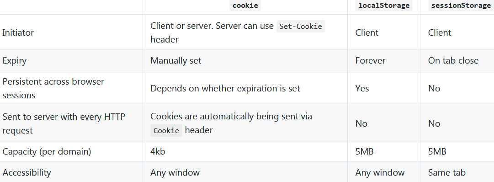

# Links #
## Links for Web development ##
1. [MDN Web docs](https://developer.mozilla.org/en-US/ "The MDN web development portal")
2. [W3Schools](https://www.w3schools.com)
3. [Scalable Fonts](https://fontawesome.com/)
4. [High quality images](https://pixabay.com/en/)
5. [Check cross browser compatibility](https://caniuse.com/)

**Inspirational web developer portfolio sites:**

1. [Nice simple home page by Ben.](http://benadam.me/)
2. [Checkout the contact form](https://sebkay.com/contact/)
3. [Interesting transitions](https://jonny.me)
4. [Nice sidebar and navigations](https://imdev.in/)

**Cookie-LocalStorage-SessionStorage quick info:**

