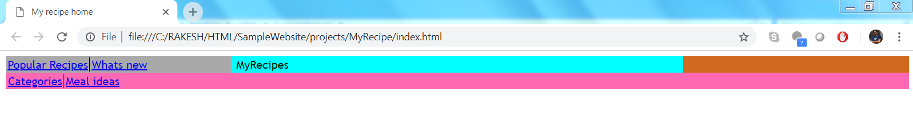

# Creating a header

1. Using table,float,width
----------

A table can be used to have adjacent navigation elements

            
			<table>
                <tr>
                    <td class="forseperator"><a href="/popularrecipes">Popular Recipes</a></td>
                    <td><a href="/whatsnew">Whats new</a></td>
                </tr>
            </table>

Use a CSS property `float: left` and `width: 25%` to create 2 columns.   

		.leftnav {
            background-color: darkgrey;
            float: left;
            width: 25%;
        }

        .centernav {
            background-color: cyan;
            width: 75%;
        }

**The result:**

----------
